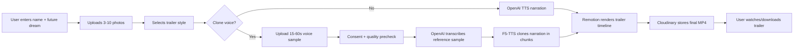
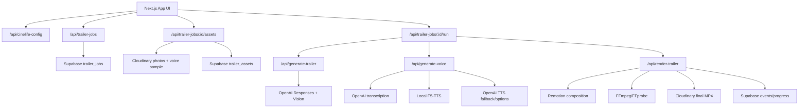
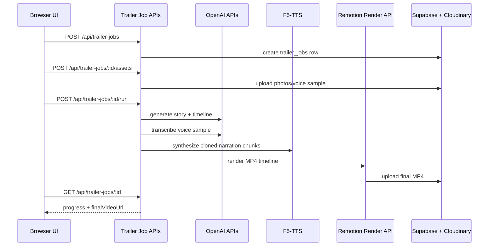

# CineLife AI

CineLife AI turns personal photos, a future dream, and optional voice reference audio into a Netflix-style life trailer.

The app generates a real downloadable MP4 using:

- Next.js, TypeScript, Tailwind, and Framer Motion for the product UI
- OpenAI Responses API for photo-aware trailer story generation
- OpenAI transcription and TTS for narration support
- F5-TTS for local voice cloning when `Clone My Voice` is selected
- Remotion for cinematic timeline rendering
- FFmpeg/FFprobe for audio processing and MP4 support
- Cloudinary for media storage and final trailer delivery
- Supabase for anonymous job ownership, job state, assets, and events

## Product Flow



## Architecture



## Features

- Anonymous job owner creation for local browser users
- 3-10 photo upload with cinematic previews
- Trailer styles:
  - Inspirational
  - Emotional
  - Thriller
  - Sci-Fi
  - Documentary
  - Motivational
- OpenAI photo-aware story and narration generation
- OpenAI TTS voice options
- Local F5-TTS voice cloning from uploaded reference audio
- Voice-cloning consent gate with speech, duration, volume, and noise precheck
- Local and stored voice-sample deletion controls
- Failed job retry controls for voice/render stages using the same job assets
- Remotion MP4 rendering at 1920x1080
- Cloudinary MP4 upload and delivery
- Numeric progress model from job creation to completion
- Final output focused on the generated video, not narration debug UI

## Requirements

- Node.js 20+
- npm
- Python 3.11 for F5-TTS
- FFmpeg installed locally for F5-TTS and FFprobe duration checks
- OpenAI API key
- Cloudinary account
- Supabase project

On macOS with Homebrew:

```bash
brew install ffmpeg
```

## Local Setup

Install Node dependencies:

```bash
npm install
```

Create `.env.local`:

```bash
cp .env.local.example .env.local
```

Fill in the required values:

```bash
OPENAI_API_KEY=sk-...

NEXT_PUBLIC_SUPABASE_URL=https://your-project.supabase.co
NEXT_PUBLIC_SUPABASE_ANON_KEY=...
SUPABASE_URL=https://your-project.supabase.co
SUPABASE_SERVICE_ROLE_KEY=...
SUPABASE_JOB_ARTIFACTS_BUCKET=cinelife-job-artifacts

CLOUDINARY_CLOUD_NAME=...
CLOUDINARY_API_KEY=...
CLOUDINARY_API_SECRET=...
```

Run the app:

```bash
npm run dev
```

Open:

[http://localhost:3000](http://localhost:3000)

## Supabase Setup

Apply the migration:

```bash
supabase/migrations/001_cinelife_trailer_jobs.sql
```

It creates:

- `trailer_jobs`
- `trailer_assets`
- `trailer_events`

The app uses Supabase service role only on the server. Never expose `SUPABASE_SERVICE_ROLE_KEY` to the browser.

## Cloudinary Setup

CineLife stores:

- Photos in `cinelife/users/{userId}/jobs/{jobId}/photos`
- Voice samples and generated audio in `cinelife/users/{userId}/jobs/{jobId}/audio`
- Final MP4 trailers in `cinelife/users/{userId}/jobs/{jobId}/trailers`

## F5-TTS Voice Cloning

Install F5-TTS outside the repository so Next/Turbopack does not scan Python virtualenv files:

```bash
python3.11 -m venv ~/.cinelife-f5-venv
~/.cinelife-f5-venv/bin/python -m pip install --upgrade pip
~/.cinelife-f5-venv/bin/pip install f5-tts
```

Then configure `.env.local`:

```bash
F5_TTS_ENABLED=true
F5_TTS_CLI_PATH=/Users/YOUR_USER/.cinelife-f5-venv/bin/f5-tts_infer-cli
F5_TTS_MODEL=F5TTS_v1_Base
F5_TTS_DEVICE=mps
F5_TTS_TIMEOUT_MS=600000
F5_TTS_SPEED=0.82
F5_TTS_CHUNK_CHARS=420
```

Use `F5_TTS_DEVICE=cpu` if Apple Silicon MPS is unavailable.

Voice sample requirements:

- 15-60 seconds
- clear speech
- minimal background noise
- no music over the voice
- enough spoken words for transcription
- explicit consent in the app before cloned narration is generated

If F5-TTS is not enabled, CineLife can still use OpenAI TTS voice options. `Clone My Voice` requires a valid F5-TTS setup or a secured external clone service.

## External Voice Clone Service

Optional:

```bash
VOICE_CLONING_API_URL=https://your-secure-clone-service/generate
VOICE_CLONING_API_KEY=...
```

When present, CineLife sends:

```json
{
  "script": "clean narration text",
  "voiceSampleDataUrl": "data:audio/...",
  "voiceSampleName": "sample.wav",
  "voiceSampleProfile": {},
  "voiceSampleQuality": {},
  "voiceConsentAccepted": true
}
```

The service should return audio bytes.

## API Routes



Routes:

- `GET /api/cinelife-config`
- `POST /api/trailer-jobs`
- `POST /api/trailer-jobs/[jobId]/assets`
- `DELETE /api/trailer-jobs/[jobId]/assets`
- `POST /api/trailer-jobs/[jobId]/run`
- `GET /api/trailer-jobs/[jobId]`
- `POST /api/generate-trailer`
- `POST /api/generate-voice`
- `POST /api/render-trailer`

## Verification

```bash
npm run lint
npm run build
```

Build can show Turbopack warnings about the dynamic render route. The current app still compiles successfully.

## Troubleshooting

### F5-TTS voice is too fast

Lower:

```bash
F5_TTS_SPEED=0.78
```

Then restart `npm run dev`.

### F5-TTS only speaks part of the narration

The app chunks the narration and concatenates the generated WAVs. Reduce chunk size if F5 fails on long sentences:

```bash
F5_TTS_CHUNK_CHARS=320
```

### F5-TTS says FFmpeg is missing

Install:

```bash
brew install ffmpeg
```

### Uploaded voice does not clone well

Use a cleaner sample with clear spoken words, no music, and 15-60 seconds of steady speech.

### Voice sample fails precheck

CineLife checks for detectable speech, valid duration, usable volume, and noise/silence level before cloning. Re-record in a quiet room, speak continuously, and avoid music or fan noise.

### Voice or render job fails

Use the retry controls in the failed job panel. The app reuses the same Supabase job and Cloudinary assets instead of making you upload photos again.

### Final video cuts off narration

The render route measures generated audio with `ffprobe` and extends the Remotion duration up to the product cap of 60 seconds. If your narration is longer than 60 seconds, shorten the generated script or increase the product cap deliberately.

## Security Notes

- Never hardcode secrets.
- Keep `.env.local` untracked.
- Keep `SUPABASE_SERVICE_ROLE_KEY`, Cloudinary secret, and OpenAI key server-only.
- Store voice samples only for the job.
- Require explicit user consent before production voice cloning.
- Delete stored voice samples through the job assets API when users request removal.

## Recommended Next Steps

- Move F5 and Remotion work to a durable background worker.
- Add authenticated user accounts for saved trailer history.
- Add generated trailer deletion controls and retention policies.
- Extend retry controls to story/upload stages.
- Add music selection and waveform-based ducking controls.
